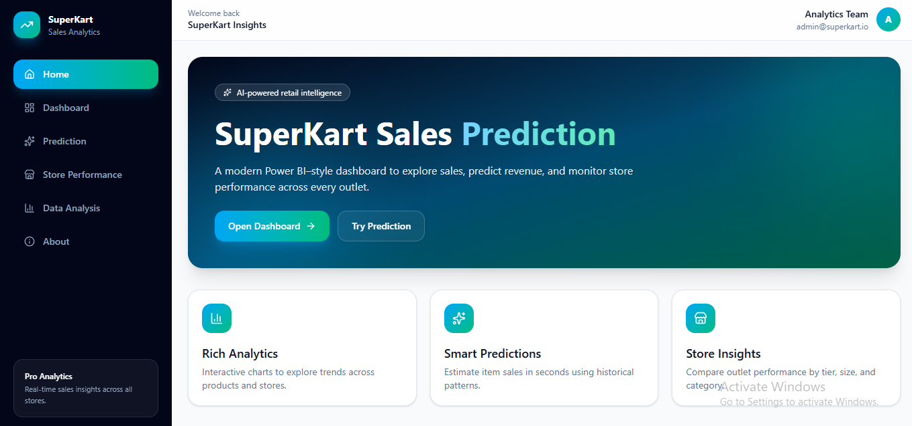
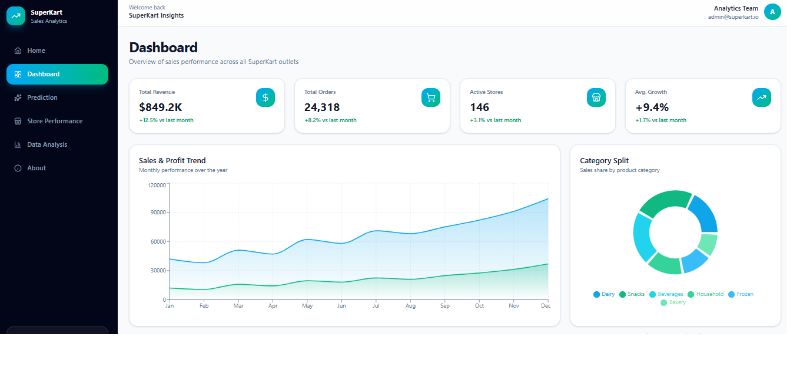

# 🛒 SuperKart Sales Prediction & Business Intelligence Dashboard

An AI-powered retail sales prediction project developed during the NTI AI for Business Training Program.

## 📌 Project Overview

This project predicts product sales using Machine Learning and provides an interactive dashboard for business insights. The solution includes data preprocessing, feature engineering, model training using XGBoost, and a user-friendly Streamlit application for real-time sales prediction and visualization.

---

## 🚀 Features

- Data Cleaning & Preprocessing
- Exploratory Data Analysis (EDA)
- Feature Engineering
- XGBoost Regression Model
- Sales Prediction
- Interactive Streamlit Dashboard
- Business Insights Visualization
- User-Friendly Interface

---

## 🛠️ Technologies

- Python
- Pandas
- NumPy
- Scikit-Learn
- XGBoost
- Streamlit
- Plotly
- Matplotlib
- Git & GitHub

---

## 📊 Dataset

**SuperKart Retail Sales Dataset**

The dataset contains retail sales information used to build a machine learning model capable of predicting product sales based on multiple business-related features.

---

## 👨‍💻 Team

- Mostafa Shora
- Moaz Nasser
- Mostafa Mohamed

---

## 📈 Model Performance

- **R² Score:** 0.927
- **MAE:** 121.53
- **RMSE:** 288.38

---

## 📷 Project Screenshots

### 🏠 Home Page



---

### 📊 Dashboard



---

### 📈 Data Analysis


---

### 💰 Sales Prediction


---

### 📉 SuperKart Insights


---

## ▶️ How to Run

1. Clone the repository

```bash
git clone https://github.com/mostafashora09-svg/SuperKart-Sales-Prediction.git
```

2. Install dependencies

```bash
pip install -r requirements.txt
```

3. Run the Streamlit application

```bash
streamlit run streamlit_app.py
```

---

## 📂 Project Structure

```text
SuperKart-Sales-Prediction/
│
├── images/
├── streamlit_app.py
├── SuperKart.csv
├── SuperKart_Sales_Prediction.ipynb
├── Xtrain.csv
├── Xtest.csv
├── ytrain.csv
├── ytest.csv
├── requirements.txt
├── README.md
└── .gitignore
```

---

## ⭐ Acknowledgment

This project was developed as part of the **NTI AI for Business Training Program**, focusing on applying Machine Learning techniques to solve real-world retail business problems.
